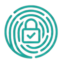

<div align="center">



# Askrypt

**Password manager without a master password**

[](LICENSE)
[](https://github.com/askrypt/askrypt/actions/workflows/ci.yml)


⚠️ **Askrypt is under active development and has not undergone extensive security testing. Use at your own risk.** ⚠️

</div>

## Overview

Askrypt is a cross-platform password/secret manager that **does not require a master password**.
Instead of memorizing one master secret, you unlock your vault by answering a set of personal
**security questions** known only to you. Your answers are never stored — they are normalized and
run through PBKDF2-HMAC-SHA256 to derive the keys that encrypt your data with AES-256-CBC.

A vault is a single portable `.askrypt` file (a ZIP archive of JSON metadata and encrypted blobs)
that you can move between devices.

## How it works

Your answers are never written to disk. Before any key derivation, each answer is **normalized**:
lowercased, with all whitespace and dashes stripped, and optionally transliterated from
Russian/Ukrainian. The vault uses a **layered** scheme so answers can be changed without
re-encrypting everything:

- Answers are normalized, then stretched with **PBKDF2-HMAC-SHA256** (600,000 iterations by default).
- The **first answer** unlocks the remaining security questions.
- **All answers together** unlock the master key.
- The **master key** encrypts the actual secrets (AES-256-CBC).

See [`SPEC.md`](SPEC.md) for the complete vault format and algorithm.

## Features

- 🔑 **No master password** — authentication via answers to personal security questions.
- 🧅 **Layered encryption** — change answers without re-encrypting all your data.
- 🔒 **Strong crypto** — AES-256-CBC with PBKDF2-HMAC-SHA256 key derivation.
- 🎲 **Password generator** — configurable character sets and length.
- 🌐 **Transliteration** — Russian/Ukrainian → English (BGN/PCGN) answer normalization.
- 🏷️ **Organize** — tags, search, and hidden entries.
- 🖥️ **Desktop** — auto-lock, Smart Lock, and system-tray integration.
- 📱 **Mobile** — biometric quick-unlock and auto-clearing secure clipboard.
- 📦 **Portable vaults** — a single `.askrypt` ZIP file, identical across platforms.

## Performance

PBKDF2 is intentionally slow to resist brute-force and dictionary attacks. The iteration count is
tunable to balance security against unlock latency; Askrypt defaults to **600,000** iterations.

Benchmarks on a typical system:

| Iterations | Approx. time |
|-----------:|:-------------|
| 100,000    | ~100 ms      |
| 600,000    | ~600 ms      |
| 1,000,000  | ~1000 ms     |

> On mobile, derivation runs on native, hardware-accelerated platform crypto, so the same iteration
> count is noticeably faster than the pure-Dart fallback used in tests.

## Apps & architecture

The repository is a Cargo workspace with a shared crypto core plus a desktop and a mobile app.

- **`core/` — `askrypt-core`** — the crypto/format engine and the **source of truth** for the vault
  format: encryption, key derivation, ZIP handling, the password generator, and transliteration.
- **Desktop (`src/`)** — a GUI built with the [Iced](https://github.com/iced-rs/iced) framework for
  **Linux, macOS, and Windows**. Depends on `askrypt-core`.
- **Mobile (`app/`)** — a **pure-Dart Flutter** app for **Android and iOS** (no Rust on device).
  It re-implements the vault format in Dart and stays byte-compatible with `core/`, verified by
  golden test vectors. *In progress* — see [`app/PLAN.md`](app/PLAN.md).

## Build & test

### Desktop / core (Rust)

```sh
cargo test --workspace                 # run the test suite (core is the spec source of truth)
cargo clippy --workspace --all-targets # lint
cargo build -p askrypt                 # build the desktop binary

# Regenerate the Dart parity vectors after any format/normalization change:
cargo run -p askrypt-core --example gen_vectors
```

### Mobile (Flutter)

```sh
cd app
flutter test     # crypto parity + session + passgen + widget tests
flutter analyze
# Build the APK for (Android arm64)
flutter build apk --release --target-platform android-arm64
```

## Install (desktop)

**Linux:**

```sh
cargo build --release
sudo ./install-desktop.sh
```

This installs the binary, icon, and a desktop entry so Askrypt appears in your application menu.

- **macOS:** use [`package-macos.sh`](package-macos.sh) to produce an app bundle.
- **Debian/Ubuntu:** a `.deb` can be built via the `cargo-deb` metadata in [`Cargo.toml`](Cargo.toml).

## Known issues

- **macOS:** system-tray integration does not work.
- **iOS:** the Flutter mobile app has not been tested yet.

## Status

Askrypt is under active development and **has not undergone extensive security testing** — use at
your own risk. Roadmap and phase status live in [`TODO.md`](TODO.md) and [`app/PLAN.md`](app/PLAN.md).

## References

- [OWASP Password Storage Cheat Sheet](https://cheatsheetseries.owasp.org/cheatsheets/Password_Storage_Cheat_Sheet.html)

## License

Licensed under the **Apache License 2.0**. See [`LICENSE`](LICENSE) for details.
